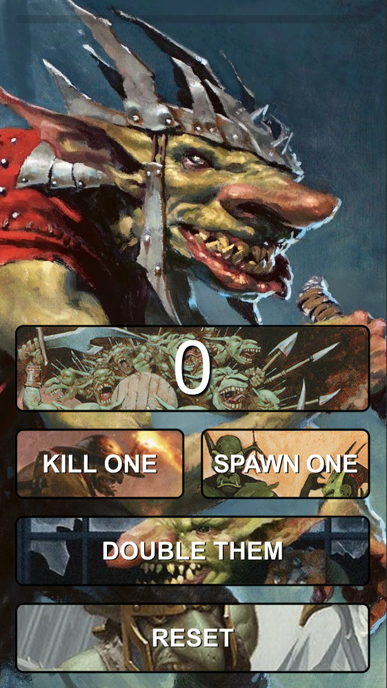

# KrenkoHelper

**KrenkoHelper** is a mobile-first Progressive Web App (PWA) built with Next.js, designed to assist Magic: The Gathering players piloting a Krenko, Mob Boss commander deck. The app simplifies gameplay by helping you keep accurate track of the number of goblin tokens generated during a match. Optimized for on-the-go use with full offline support, KrenkoHelper ensures smooth and focused gameplay without the need for pen and paper.

## 📸 App Preview



## 🚀 Features

- 📱 Mobile-first UI
- ⚡ Offline support with PWA capabilities
- 👺 Real-time goblin token counter
- 🧼 Simple and clean interface for in-game use

## 📲 Install KrenkoHelper as a PWA

You can install KrenkoHelper directly to your mobile home screen for a native app-like experience.

### For iOS (Safari)

1. Open the app in Safari.
2. Tap the **Share** button (square with an arrow pointing up).
3. Scroll down and tap **Add to Home Screen**.
4. Optionally, rename the app and tap **Add**.

The app will now appear on your home screen and open in its own window, just like a native app.

### For Android (Chrome or Edge)

1. Open the app in Chrome or Edge.
2. Tap the **three-dot menu** in the top-right corner.
3. Select **Add to Home screen** or **Install app**.
4. Confirm and the app will be added to your home screen.

Once installed, it behaves just like a native app — with offline support and no browser UI.

## 🧪 Development

This app is built with [Next.js](https://nextjs.org/) and configured as a PWA using [next-pwa](https://github.com/shadowwalker/next-pwa).

```bash
npm install
npm run dev
